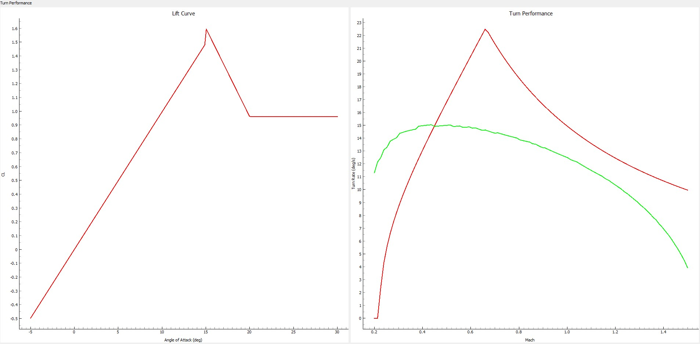
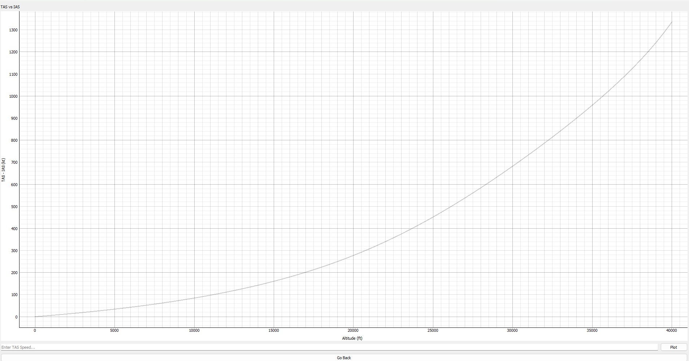
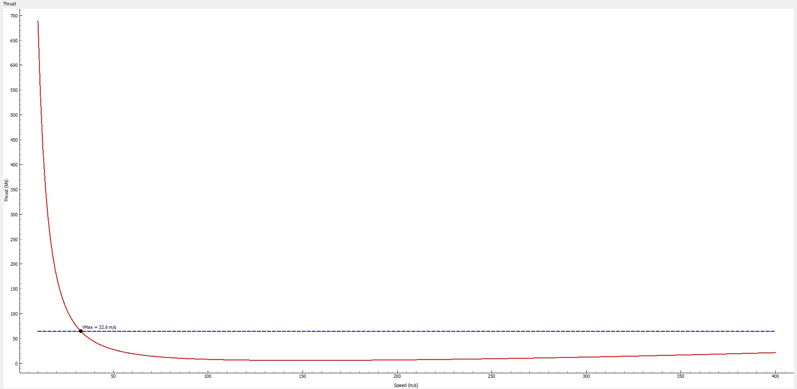

# Flight-Model-Calculator

## Flight Model Calculator: A Desktop application to calculate certain aircraft values, written in Python and using PyQT5 and pyqtgraph.

I built this project to teach myself PyQt5 for GUI development and PyQTgraph for interactive plotting.
My goals for the project are to gain hands-on experience in:
- Building desktop applications with a responsive user interface
- Integrate real-time graphing and visualization
- Learning event-driven programming in Python

## Features

The functionality and GUI is built in PyQT5 and provides either the creation of a .json file in the correct file format, or opening one up that was created previously at the start. Afterwords, the user currently
has three graphs they can choose and they are as follows:

### Lift and Turn Curve
This curve shows the lift based on the angle of attack, using values inputted by the user at the creation of their aircraft file. The graph itself shows how the lift increases until the maximum lift coefficient is hit, which
it then can take two routes. Currently, my program handles two states when this is hit, either drop to a certain percentage of the lift or flattens out when max lift is hit. The turn curve shows the instantaneous and sustained turn rates
of the given aircraft at a given Mach speed, with the red curve being the theoretical maximum turn rate and the green being the sustained where thrust = drag (the speed remains constant). An example of what these curves can look like is below:

### TAS (True Airspeed) vs IAS (Indicated Airspeed)
This graph illustrates the differences between the True airspeed, the actual speed the aircraft is going, vs the Indicated airspeed, the airspeed when accounting for air pressure. As a plane goes higher up, these two values get further apart, which 
is illustrated with the graph as shown below:

### Thrust
This graph shows thrust needed to balance the drag experienced, with VMax representing the maximum speed at that altitude at non-afterburner engine settings if applicable. The graph appears as follows:

To do all of these graphs, I use numpy to give me limits of the graph and a QLineEdit to let the user input different values to change the graph, for example the user can change the altitude at which the turn curve occurs which affects the turn rate
due to drag caused by air pressure.

## Tech Stack
- Python 3
- PyQT 5
- PyQTGraph
- NumPy

## Future Plans
In the future I plan to implement the following:
- Include afterburner thrust in the Thrust graph
- Be able to compare two files on the turn curve
- Include a G-limit into the Turn curve
- Have a time to a given speed over different altitudes
- Integrate Figma UI design into this project for a more approachable program
